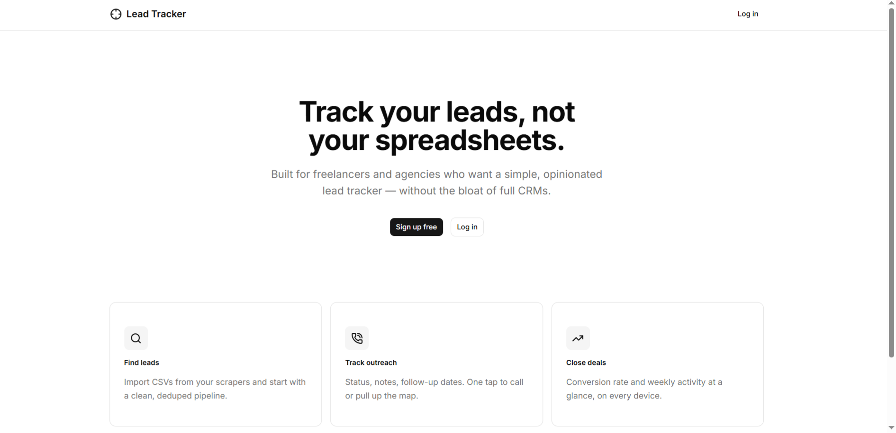
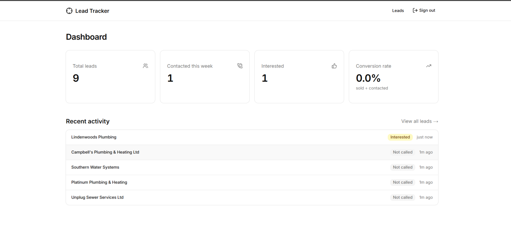
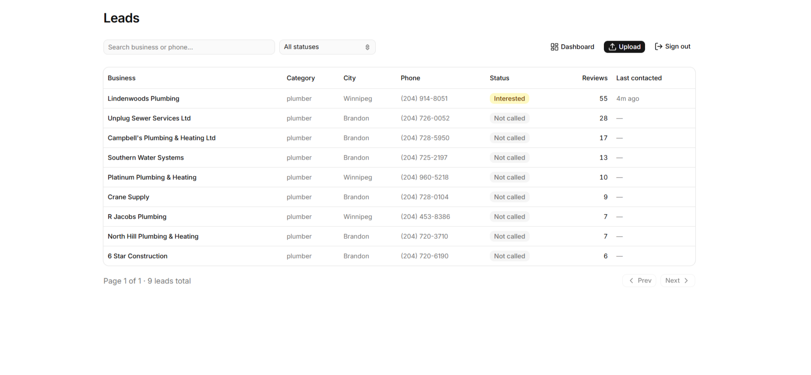
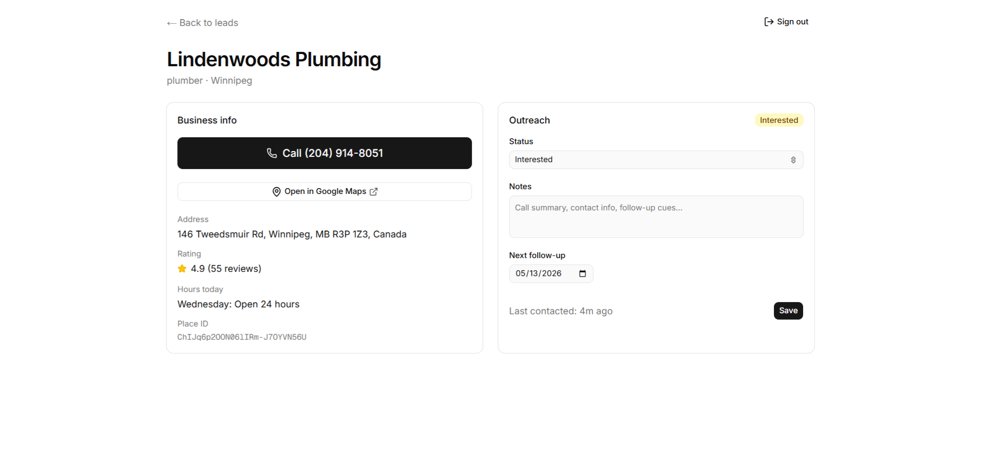
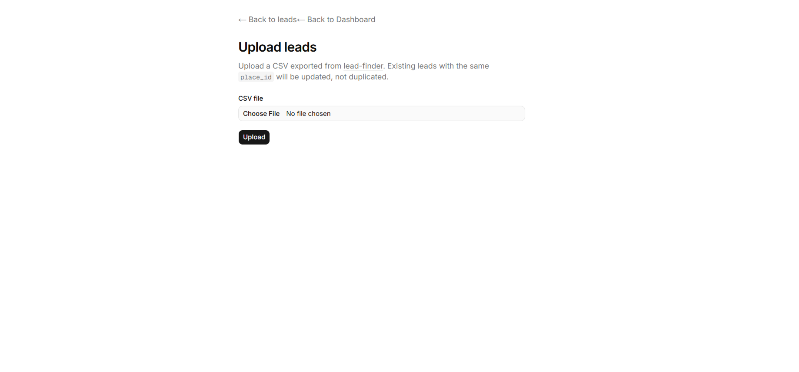
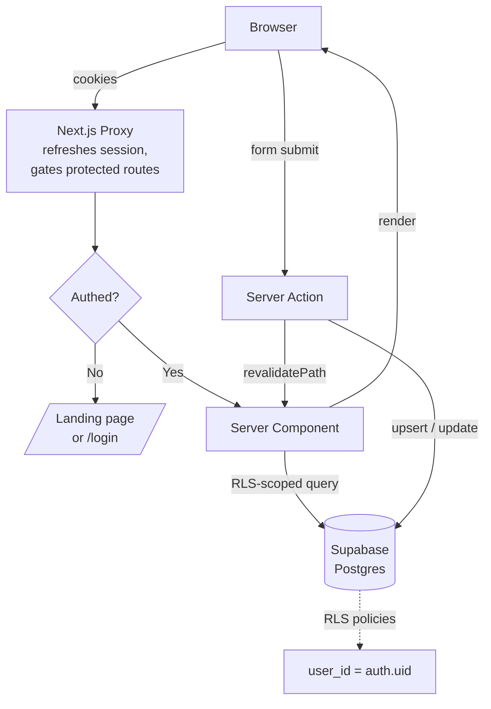

# lead-tracker


> A focused lead-tracking dashboard for cold-call outreach. Upload a CSV from [lead-finder](https://github.com/Vshivam01/lead-finder), and turn it into a deduped, status-tracked, follow-up-aware pipeline you can actually work through one call at a time.

**Live demo:** [lead-tracker-orcin.vercel.app](https://lead-tracker-orcin.vercel.app/)

---

## Why I built this

I built [`lead-finder`](https://github.com/Vshivam01/lead-finder) earlier — a Python CLI that scrapes Google Places for local businesses without websites. It outputs CSVs of qualified prospects.

But CSVs aren't where outreach lives. After 50 leads in a spreadsheet, you've lost track of who you called, what they said, when to follow up. So I built `lead-tracker` — a small, opinionated web app that turns those CSVs into a working sales pipeline. Upload, status, notes, follow-up dates, click-to-call. Nothing more.

This is the second half of a workflow I actually use to sell websites to local Manitoba businesses.

---

## Features

- **CSV import with dedupe.** Re-uploading the same file updates existing rows instead of duplicating, scoped per user via a unique `(user_id, place_id)` constraint.
- **Status pipeline.** Five-step funnel — `not_called → voicemail → interested → not_interested → sold` — backed by a Postgres enum, not a free-text column.
- **Optimistic UI.** Status changes flip instantly; failed saves silently revert via React 19's `useOptimistic`.
- **Click-to-call + Google Maps.** Big tappable phone link for in-the-field calling. One-tap to the business's Maps listing.
- **Server-side search, filter, sort, paginate.** All driven by URL params. Sharing a filtered view = sharing a URL.
- **Dashboard metrics.** Total leads, contacted this week, interested count, conversion rate. Four parallel queries for sub-100ms TTFB.
- **Auth + per-user isolation via Postgres RLS.** Not application-level checks — Row Level Security policies at the database. The publishable Supabase key in the browser physically cannot read another user's leads.
- **Mobile responsive.** Designed phone-first since this is a tool for sales reps in the field.

---

## Screenshots

### Landing page
The first thing recruiters and prospective users see.



### Dashboard
Four parallel stat queries plus the five most-recently-touched leads.



### Leads table
Server-side search, status filter, sort, pagination — all URL-driven so views are shareable.



### Lead detail
The page you actually use during a call. Big phone link, status dropdown with optimistic updates, notes textarea, follow-up date.



### CSV upload
Dedupes on `place_id` per user, so re-uploading is safe.



---

## Tech stack

| Layer | Choice |
|---|---|
| Framework | Next.js 16 (App Router, Turbopack) |
| Language | TypeScript with strict mode + `noUncheckedIndexedAccess` |
| Database | Supabase (Postgres + Row Level Security) |
| Auth | Supabase Auth (`@supabase/ssr`) |
| UI | shadcn/ui + Tailwind CSS v4 + Lucide icons |
| Forms | React Server Actions + Zod validation |
| State | `useActionState` + `useOptimistic` (React 19) |
| Testing | Vitest (48 unit tests, hermetic, no network) |
| CSV parsing | papaparse |
| Hosting | Vercel |

---

## Architecture



The auth flow is the trickiest piece: the proxy (`proxy.ts`) runs on every request, refreshes the Supabase session if it's expired, and writes the new cookie to both the inbound request (so downstream Server Components see the fresh session) and the outbound response (so the browser persists it). User isolation is enforced at the database via four RLS policies, not in application code.

For deeper engineering notes, see commits — each one is scoped to a logical feature and explained in its message.

---

## Project structure

```
lead-tracker/
├── app/
│   ├── (auth)/             # /login and /signup, route group with shared layout
│   ├── leads/              # table view, detail page, server actions
│   ├── upload/             # CSV upload page + server action
│   ├── page.tsx            # router: landing for logged-out, dashboard for logged-in
│   ├── error.tsx           # global error boundary
│   └── not-found.tsx       # custom 404
├── components/
│   ├── auth/               # shared auth form
│   ├── dashboard/          # stat cards, recent activity
│   ├── leads/              # toolbar, table cells, outreach card, status badge
│   └── ui/                 # shadcn primitives
├── lib/
│   ├── supabase/           # server, browser, middleware clients
│   ├── leads/              # parser, schema, pagination math
│   ├── dashboard/          # stat queries, conversion-rate calc
│   ├── validation/         # Zod schemas
│   ├── safe-redirect.ts    # OWASP A01 unvalidated-redirect defense
│   └── format.ts           # relative time helper
├── supabase/migrations/    # checked-in SQL migrations
├── proxy.ts                # session refresh + route protection
└── vitest.config.ts
```

---

## Engineering details worth a closer look

A few things in this codebase aren't obvious from a casual scan:

**Open-redirect defense (`lib/safe-redirect.ts`).** After login, users are redirected to a `next` query param. Naive trust would let `?next=//evil.com` send users to a phishing page. The helper rejects any `next` that starts with `//` or `/\` — OWASP A01 territory. Tests in `lib/safe-redirect.test.ts` enumerate seven attack vectors.

**PostgREST filter injection defense (`app/leads/page.tsx`).** Supabase's `.or()` filter takes a string-formatted expression. Naively splatting user search input into it lets an attacker write `q=a,status.eq.sold` and bypass the search to read all sold leads. The page strips filter-grammar characters (`,()*:%`) before interpolation.

**Authoritative auth via `getUser()` not `getSession()`.** `getSession()` decodes the JWT locally without validating against Supabase. An attacker who can write cookies can forge a session. `getUser()` calls Supabase's `/auth/v1/user` endpoint and validates the signature server-side.

**Database-level isolation via RLS.** No `.eq("user_id", ...)` anywhere in the app code — RLS policies enforce it. If you want to convince yourself: in the Supabase SQL editor, run `select * from leads where user_id != auth.uid()` — always returns empty.

**Optimistic updates with automatic rollback.** Status changes use `useOptimistic`. On server-action success, `revalidatePath` fires and the optimistic state matches the new server state. On failure, no revalidation happens, the optimistic state is discarded on next render, the badge snaps back. No explicit rollback code — React's reactivity does it.

---

## Local setup (Windows)

### 1. Prerequisites

- Node.js 20+ ([nodejs.org](https://nodejs.org))
- A free Supabase account ([supabase.com](https://supabase.com))

### 2. Clone and install

```powershell
git clone https://github.com/Vshivam01/lead-tracker.git
cd lead-tracker
npm install
```

### 3. Set up Supabase

1. Create a new Supabase project at [supabase.com/dashboard](https://supabase.com/dashboard).
2. In **SQL Editor**, paste and run the contents of `supabase/migrations/20260429120000_init.sql`.
3. In **Authentication → Providers → Email**, enable email provider and disable "Confirm email" (for the demo).
4. Get your project URL and publishable key from **Settings → API**.

### 4. Environment variables

```powershell
copy .env.local.example .env.local
notepad .env.local
```

Fill in:

```
NEXT_PUBLIC_SUPABASE_URL=https://YOUR_PROJECT.supabase.co
NEXT_PUBLIC_SUPABASE_ANON_KEY=sb_publishable_...
```

### 5. Run

```powershell
npm run dev
```

Open [http://localhost:3000](http://localhost:3000).

---

## Running the tests

```powershell
npm test
```

48 tests across 5 files. Hermetic — no network, no Supabase, no DOM. Covers:
- CSV parser (14 tests) — happy path, malformed rows, BOM, type coercion
- Pagination math (13 tests) — clamping, overshoot, edge cases
- Format helpers (8 tests) — relative time with frozen clock
- Safe-redirect (7 tests) — open-redirect attack vectors
- Conversion rate (6 tests) — zero denominator, rounding

---

## Configuration

| Env var | Required | Description |
|---|---|---|
| `NEXT_PUBLIC_SUPABASE_URL` | yes | Your Supabase project URL. |
| `NEXT_PUBLIC_SUPABASE_ANON_KEY` | yes | Publishable (anon) key. Safe in browser when RLS is enabled. |

---

## Limitations & future work

- **CSV upload is bounded by Vercel's request body limit.** ~5MB cap on the free tier; comfortably handles a few thousand rows. Streamed multipart upload would lift this.
- **No team/multi-user accounts.** Each user's leads are private. Sharing a lead with a teammate isn't possible without a separate `team_id` column and policy rewrite.
- **No real-time updates.** If you have the leads page open in two tabs and update from one, the other won't auto-refresh until you reload. Supabase Realtime would solve this; not worth the complexity for a single-user MVP.
- **Email confirmation is disabled** for demo simplicity. Re-enable in Supabase auth settings before any real-world use.
- **Conversion rate excludes uncalled leads** (`sold ÷ contacted`, not `sold ÷ total`). Defensible default but won't match every spreadsheet.
- **Future:** Realtime sync, team accounts, JSON export, automated follow-up reminders, per-status conversion funnel, integration with phone-call logging.

---

## License

MIT — see [LICENSE](LICENSE).